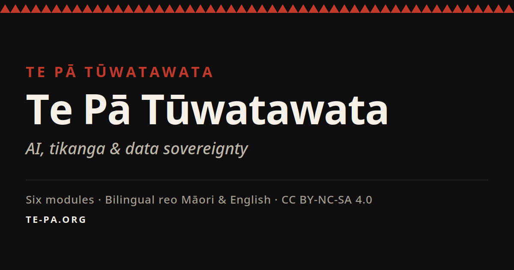

# Te Pā Tūwatawata



**He akoranga hono AI ki te ao Māori, ki te tino rangatiratanga o te raraunga.**  
A bilingual course connecting AI, Māori data sovereignty, and community activism.

→ **Live site:** [te-pa.org](https://te-pa.org)  
→ **Repository:** [github.com/robertmccallnz/kiwi-dialectic-te-pa-minisite](https://github.com/robertmccallnz/kiwi-dialectic-te-pa-minisite)

---

## About

Te Pā Tūwatawata is a six-module bilingual course — te reo Māori and English — exploring the intersection of artificial intelligence, Māori data sovereignty, and kaupapa Māori education. Built for communities, educators, and activists.

Pedagogy grounded in Freire · Graeber · Kropotkin · Kaupapa Māori.  
Design grounded in the Tino Rangatiratanga palette: black, red, white.

---

## Site Map

| Section | URL |
|---------|-----|
| Home | [te-pa.org](https://te-pa.org/) |
| Mapper (rhizome navigation) | [te-pa.org/rhizome-mapper.html](https://te-pa.org/rhizome-mapper.html) |
| Launch Mediakit | [te-pa.org/launch-mediakit/](https://te-pa.org/launch-mediakit/) |
| Social Kit | [te-pa.org/social-kit/](https://te-pa.org/social-kit/) |
| Stickers & Posters | [te-pa.org/stickers/](https://te-pa.org/stickers/) |
| Teaching Kits | [te-pa.org/teaching-kits/](https://te-pa.org/teaching-kits/) |
| Campaign Generator | [te-pa.org/campaign-generator/](https://te-pa.org/campaign-generator/) |
| Solidarity (Australia) | [te-pa.org/solidarity/australia/](https://te-pa.org/solidarity/australia/) |
| Partner Onboarding | [te-pa.org/partner-onboarding/](https://te-pa.org/partner-onboarding/) |
| Motifs | [te-pa.org/motifs/](https://te-pa.org/motifs/) |
| Modules | [te-pa.org/modules/](https://te-pa.org/modules/) |

→ **Sitemap:** [te-pa.org/sitemap.xml](https://te-pa.org/sitemap.xml)  
→ **Robots:** [te-pa.org/robots.txt](https://te-pa.org/robots.txt)

---

## Course Modules

| Module | Title | Theme |
|--------|-------|-------|
| 1 | He Kōrero Tīmatanga | Introduction — AI and te ao Māori |
| 2 | Koru — New Growth | Data as living knowledge |
| 3 | Niho Taniwha — The Bite | AI risk and Māori communities |
| 4 | Kōwhaiwhai — Pattern | Data governance and tikanga |
| 5 | Unaunahi — Scale | Collective sovereignty |
| 6 | Takarangi — The Spiral | Future pathways |
| + | Te Pakiaka — Rhizome | Deleuze, whakapapa, lines of flight |

---

## What's in This Repo

```
index.html                    Main site — all modules, kits, social resources
rhizome-mapper.html           Interactive rhizome / lines-of-flight mapper
modules/                      Individual module pages + rhizome essay
motifs/                       Per-motif explainer pages
launch-mediakit/              Press/launch pack: thread reader, downloads
social-kit/                   Banners, captions, unaunahi assets, posters
stickers/                     17 typographic stickers + A4 sheet + gallery
teaching-kits/                Per-language teaching PDFs + manifest
campaign-generator/           Per-language campaign content generator
solidarity/australia/         FPIC-gated cross-movement solidarity page
partner-onboarding/           Partner intake docs in 6 languages
data/                         JSON: motif bank, campaign categories, calendar
pdfs/                         Teacher handbook, rhizome framework, etc.
scripts/                      Generators (i18n stickers, campaign feed, etc.)
assets/                       Shared CSS, JS, SVG motifs
og-image.png                  1200×630 Open Graph card
sitemap.xml / robots.txt      SEO
```

---

## SEO & Social Meta

- Canonical URLs on every page → `https://te-pa.org/<path>`
- Open Graph: `og:image` is `https://te-pa.org/og-image.png` (1200×630)
- Twitter Card: `summary_large_image`
- `og:locale` = `en_NZ`, alternate `mi_NZ`
- Sitemap declares hreflang for 6 site languages: `en`, `mi`, `sm`, `pt`, `gn`, `ar` (Arabic RTL)
- robots.txt blocks `/api/` and `/cron_tracking/` only

---

## Design System

| Colour | Māori name | Meaning |
|--------|-----------|---------|
| `#111111` Black | Mangu | Te Korekore — void, potential |
| `#c0392b` Red | Whero | Te Whai Ao — mana, life force |
| `#f0efe9` Off-white | Mā | Te Ao Mārama — light, clarity |

Fonts: Work Sans (body) · Instrument Serif (pull quotes) · Inter / Lora (stickers)

---

## Motifs

- **Koru** — new life, growth, te reo revitalisation
- **Niho Taniwha** — protection, guardian, data sovereignty
- **Kōwhaiwhai** — pattern, continuity, collective governance
- **Unaunahi** — fish scale, collective strength, many becoming one
- **Takarangi** — spiral, cyclical time, mua/muri
- **Pakiaka** — root network, rhizome, the underground web

---

## Languages

Six site languages: **en · mi · sm · pt · gn · ar**. Arabic uses `dir="rtl"`. Aboriginal / Torres Strait Islander language text is intentionally not published in this repo until Free, Prior and Informed Consent (FPIC) is confirmed through a community partner.

---

## Licence

Creative Commons CC BY-NC-SA 4.0 — free to reproduce, share, and adapt for non-commercial purposes with attribution.

**Ko te mātauranga he taonga nō te katoa.**  
Knowledge is a treasure belonging to all.
