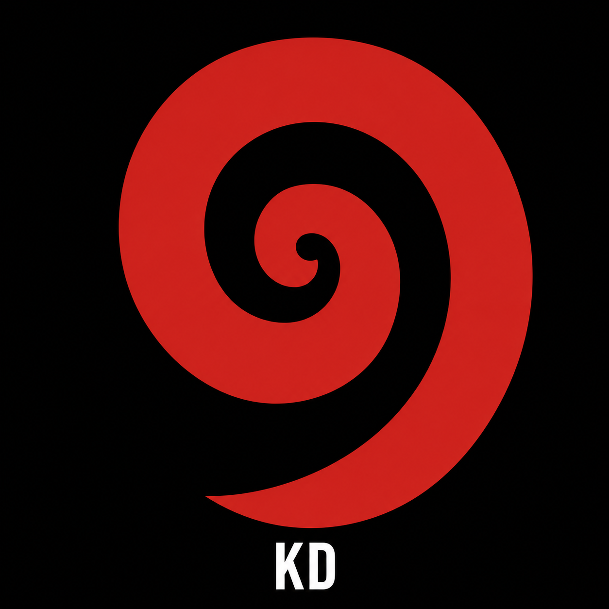

# Te Pā Tūwatawata — The Kiwi Dialectic



**He akoranga hono AI ki te ao Māori, ki te tino rangatiratanga o te raraunga.**  
A bilingual course connecting AI, Māori data sovereignty, and community activism.

→ **Live site:** [robertmccallnz.github.io/kiwi-dialectic-te-pa-minisite](https://robertmccallnz.github.io/kiwi-dialectic-te-pa-minisite)  
→ **Publication:** [kiwidialectic.com](https://www.kiwidialectic.com)

---

## About

Te Pā Tūwatawata is a six-module bilingual course — te reo Māori and English — exploring the intersection of artificial intelligence, Māori data sovereignty, and kaupapa Māori education. Built for communities, educators, and activists.

Pedagogy grounded in Freire · Graeber · Kropotkin · Kaupapa Māori.  
Design grounded in the Tino Rangatiratanga palette: black, red, white.

---

## Course Modules

| Module | Title | Theme |
|--------|-------|-------|
| 1 | He Kōrero Tīmatanga | Introduction — AI and te ao Māori |
| 2 | Koru — New Growth | Data as living knowledge |
| 3 | Niho Taniwha — The Bite | AI risk and Māori communities |
| 4 | Kōwhaiwhai — Pattern | Data governance and tikanga |
| 5 | Unaunahi — Scale | Collective sovereignty |
| 6 | Takarangi — The Spiral | Future pathways |
| + | Te Pakiaka — Rhizome | Deleuze, whakapapa, lines of flight |

---

## What's in This Repo

```
index.html                    Main site — all modules, kits, social resources
modules/                      Individual module pages + rhizome essay
assets/
  kiwi-dialectic.css          Shared design system
  motifs/                     SVG motifs: koru, kōwhaiwhai, niho taniwha, unaunahi
  social/                     Social media assets: banner, profile, symbol
pdfs/
  te-pa-teachers-handbook.pdf         Educator guide
  te-pa-arts-pedagogy-kit.pdf         Creative pedagogy (Freire, Beuys, Graeber)
  te-pa-student-activity-sheets.pdf   Six reproducible student handouts
  te-pa-rhizome-framework.pdf         Deep research: rhizome theory + 8 activist tools
  te-pa-street-art-research.pdf       Māori street art + te reo activist research
social-kit/
  *.png                        12 module + campaign memes
  platform/                    96 B&W platform memes (X, Instagram, Facebook, TikTok)
  stickers/                    16 activist stickers + A4 print sheet + zip
  te-pa-meme-kit.zip           All 108 memes bundled
  te-pa-social-media-kit.pdf   Campaign guide
```

---

## Design System

| Colour | Māori name | Meaning |
|--------|-----------|---------|
| `#111111` Black | Mangu | Te Korekore — void, potential |
| `#c0392b` Red | Whero | Te Whai Ao — mana, life force |
| `#f0efe9` Off-white | Mā | Te Ao Mārama — light, clarity |

Fonts: Work Sans (body) · Instrument Serif (pull quotes)

---

## Motifs

- **Koru** — new life, growth, te reo revitalisation
- **Niho Taniwha** — protection, guardian, data sovereignty
- **Kōwhaiwhai** — pattern, continuity, collective governance
- **Unaunahi** — fish scale, collective strength, many becoming one
- **Takarangi** — spiral, cyclical time, mua/muri
- **Pakiaka** — root network, rhizome, the underground web

---

## Licence

Creative Commons CC BY-NC-SA 4.0 — free to reproduce, share, and adapt for non-commercial purposes with attribution.

**Ko te mātauranga he taonga nō te katoa.**  
Knowledge is a treasure belonging to all.
